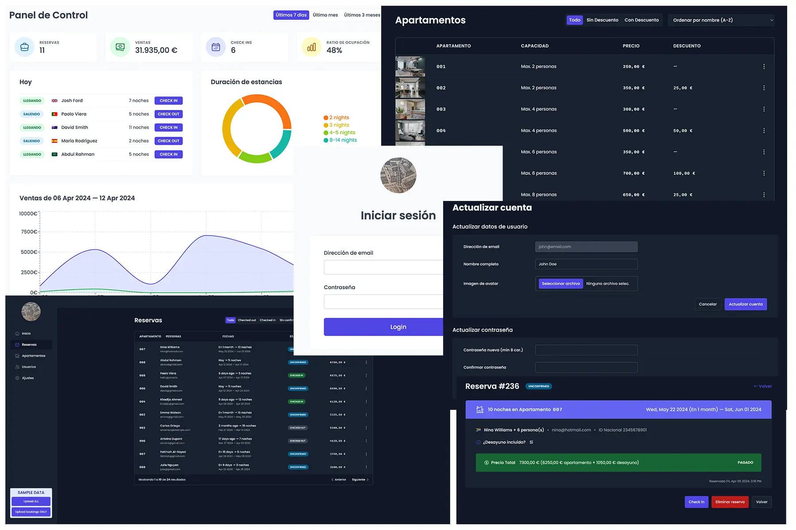

  

    
  

  <h1>Apartamentos Caterina</h1>

[Apartamentos Caterina](https://caterina.mpondev.com/) es una App creada con React para la gestión de reservas de un edificio de apartamentos.

 

## ✨ Características

- Acceso restringido a usuarios autorizados (empleados)
- Creación de nuevos usuarios y actualización de datos de usuario
- Tabla de apartamentos con detalles y capacidad de edición
- Tabla de reservas con detalles y capacidad de edición
- Filtrado y ordenación de tablas
- Gestión de llegadas y salidas, así como de los pagos realizados
- Posibilidad de añadir gastos extras (como desayunos)
- Panel de control y edición de los ajustes básicos
- Modo oscuro

 

## ⚙️ Uso

Al ser una app de gestión de negocio sólo los autorizados pueden crear nuevos usuarios. Para probar la app, utilizar las siguientes credenciales:

- email address: `john@email.com`
- Password: `1234qwer`

En caso de que no se muestren suficientes datos se puede alimentar la base de datos desde el panel inferior izquierdo.

 

## 📦 Packages:

| Package                                                                      | Description                                                                                                                                      |
| ---------------------------------------------------------------------------- | ------------------------------------------------------------------------------------------------------------------------------------------------ |
| [@tanstack/react-query](https://www.npmjs.com/package/@tanstack/react-query) | Hooks for fetching, caching and updating asynchronous data in React                                                                              |
| [date-fns](https://www.npmjs.com/package/date-fns)                           | Provides the most comprehensive, yet simple and consistent toolset for manipulating JavaScript dates in a browser & Node.js                      |
| [prop-types](https://www.npmjs.com/package/prop-types)                       | Runtime type checking for React props and similar objects.                                                                                       |
| [react-error-boundary](https://www.npmjs.com/package/react-error-boundary)   | Reusable React error boundary component. Supports all React renderers (including React DOM and React Native).                                    |
| [react-hook-form](https://www.npmjs.com/package/react-hook-form)             | Performant, flexible and extensible forms with easy-to-use validation.                                                                           |
| [react-hot-toast](https://www.npmjs.com/package/react-hot-toast)             | Smoking hot Notifications for React.                                                                                                             |
| [react-icons](https://www.npmjs.com/package/react-icons)                     | Include popular icons in your React projects easily, utilizing ES6 imports that allows you to include only the icons that your project is using. |
| [recharts](https://www.npmjs.com/package/recharts)                           | Helps you to write charts in React applications without any pain.                                                                                |

---

From [Jonas Schmedtmann](https://github.com/jonasschmedtmann)'s [Ultimate React Course: React, Redux and more](https://www.udemy.com/course/the-ultimate-react-course/?couponCode=ST8MT40924) course.
